# Congress Trades Investigation

**Can you get rich by copying Congress?** Everyone online says "copy the politicians and you'll get rich." So I backtested every disclosed trade I could find, priced against real historical market data, to see whether following politicians' trades actually beats the market. Then I went further and joined Congress trades to corporate lobbying and federal contract awards to hunt for a genuine edge.

This is the companion code for the [LosingLoonies](https://www.youtube.com/@LosingLoonies) video. Every chart, statistic, and dollar figure below is produced by the notebooks in this repo.

> **Watch the video:** [youtu.be/LvUcTBmVCXI](https://youtu.be/LvUcTBmVCXI). Subscribe at [youtube.com/@LosingLoonies](https://www.youtube.com/@LosingLoonies).

---

## Sponsorship and FTC disclosure

**This video is sponsored by [Quiver Quantitative](https://www.quiverquant.com).** Quiver paid to sponsor the video. All data sourcing, code, methodology, analysis, and conclusions are editorially independent, including the finding that a naive "copy Congress" strategy does **not** reliably beat the market.

Quiver Quantitative ([quiverquant.com](https://www.quiverquant.com), API at [api.quiverquant.com](https://api.quiverquant.com)) is the sponsor and the source of every alternative dataset used here: Congress trades, corporate lobbying, government contracts, and Trump trades. **Use code `LOONIES` for 50% off the first year of any Quiver subscription.**

This repository is data analysis and educational content. **It is not investment advice, and nothing here is a recommendation to buy or sell any security.** Past performance, including any backtested result, does not predict future returns.

---

## Data Provider

Daily stock prices and financial data are fetched from [Massive](https://massive.com/?utm_campaign=losing-loonies).

Disclosure: The link above is an affiliate link. We may receive a commission if you sign up through it, at no extra cost to you.

---

## Quick links

| | |
|---|---|
| Video | [Watch on YouTube](https://youtu.be/LvUcTBmVCXI) |
| Quiver Quantitative | [quiverquant.com](https://www.quiverquant.com), code `LOONIES` for 50% off year one |
| Quiver API | [api.quiverquant.com](https://api.quiverquant.com) |
| Market data (Massive) | [massive.com](https://massive.com/?utm_campaign=losing-loonies) (affiliate link) |

---

## The short version

1. Copying every Congress buy on the day they bought and holding 60 days **loses to the S&P 500.**
2. Fixing the two ways that backtest cheated (buying before the trade was public, and selling on an arbitrary timer) leaves a **thin but real edge** of roughly half a percent per trade, once you hold until the politician actually sells.
3. Trying to beat the market by following the money *around* the trades (lobbying spend, federal contracts, congressional attention) **backfires.** The companies most wired into Washington are slow, mature businesses, and the signal picks losers.

The honest answer: probably not. The datasets are powerful as a research tool, not as a copy signal.

---

## The investigation, step by step

The video builds its argument in order. Each notebook is one step and writes its rows to CSV, its headline numbers to a `summary_stats.json`, and its animated charts to video (rendered locally; static stills are shown below).

### Step 1: Buy the day they bought

`source_code/1-buy-the-day-they-bought.ipynb`

Pull every trade Congress has disclosed since 2012 (roughly 100,000 of them), then run one dead simple rule: every time a member buys, buy that stock the same day, hold 60 days, and sell. Equal weight, $10,000 to start, priced against real history, racing the S&P 500.

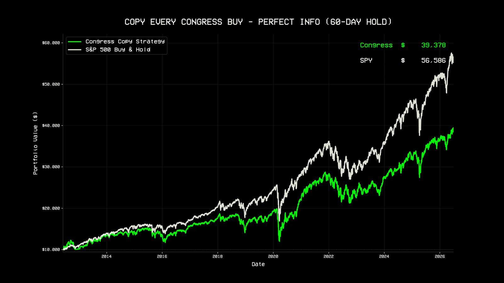

$10,000 copying every congressional buy grows to about **$39,000**. The S&P grows to about **$57,000** over the same window. The strategy wins on 56% of its individual trades but beats the S&P less than half the time. How does a portfolio full of winners lose? The 60 day timer sells winners far too early. Congress does not sell on a timer; many members hold for years.

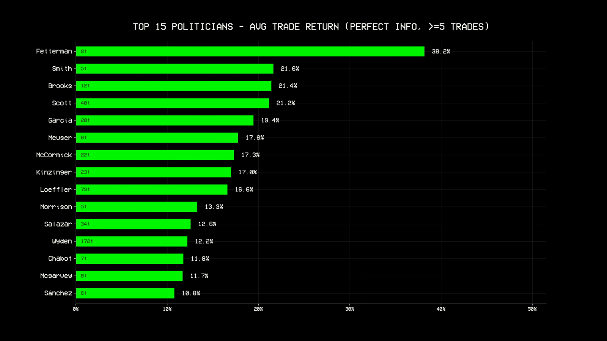

### Step 2: Only buy once the trade is public

`source_code/2-disclosure-delay.ipynb`

The first backtest cheated: it bought on the transaction date, but nobody actually knows about a trade until it is filed weeks later. This version enters on the **filing date plus one trading day**, the first day a retail follower could realistically act.

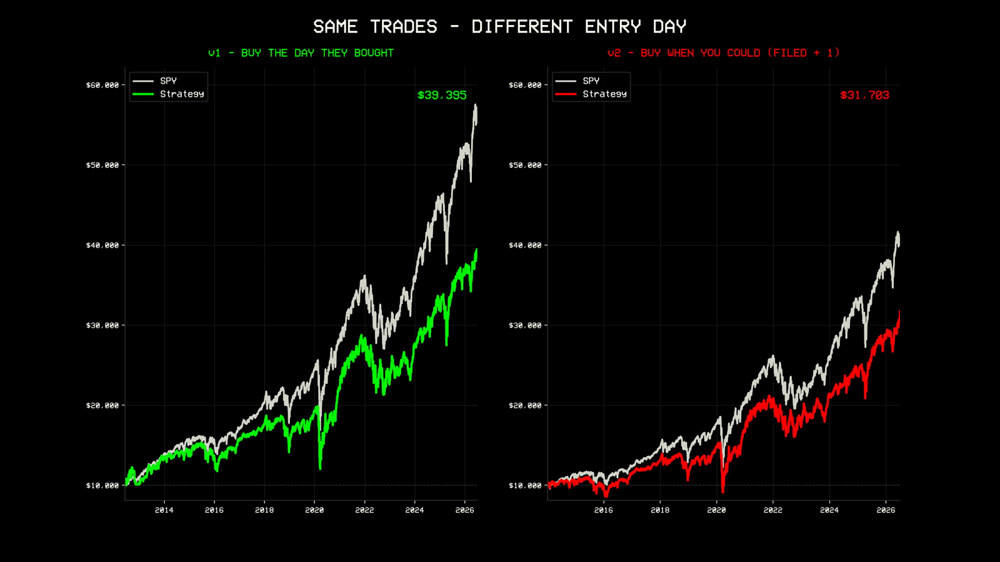

Buying weeks late erodes the entry, and the disclosure delay version still trails the market. The example below shows why the delay matters: Josh Gottheimer bought EBS on June 15, 2020, and by the time it was filed about 24 days later a lot of the move had already happened. It was still a good trade, just not as good as the insider timed version.

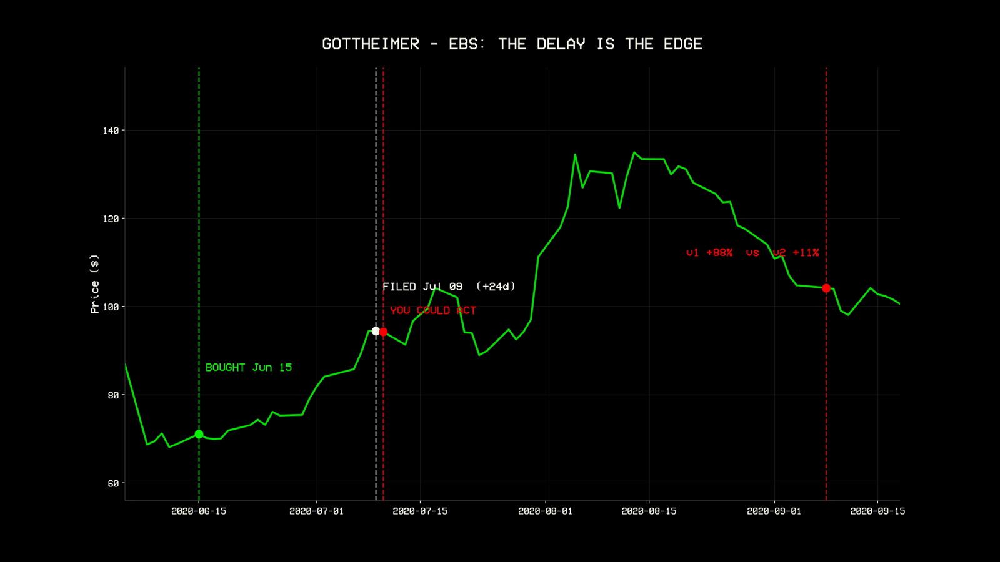

### Step 3: Hold until Congress actually sells

`source_code/3-hold-until-congress-sells.ipynb`

The second cheat was the arbitrary 60 day exit. This engine matches each disclosed buy to the same member's next disclosed sale of the same ticker, and only ever trades on dates a real person could act on. Buy when it becomes public, hold until they sell.

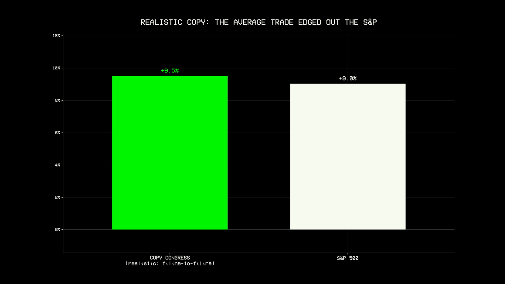

Held to the real exit, the **average trade edges the market: about 9.5% versus 9%.** So on average, copying Congress wins, by a hair. The leaderboard below ranks members by all time return on $10,000, and updates month by month in the video. Angus King, an independent, holds a surprisingly durable lead.

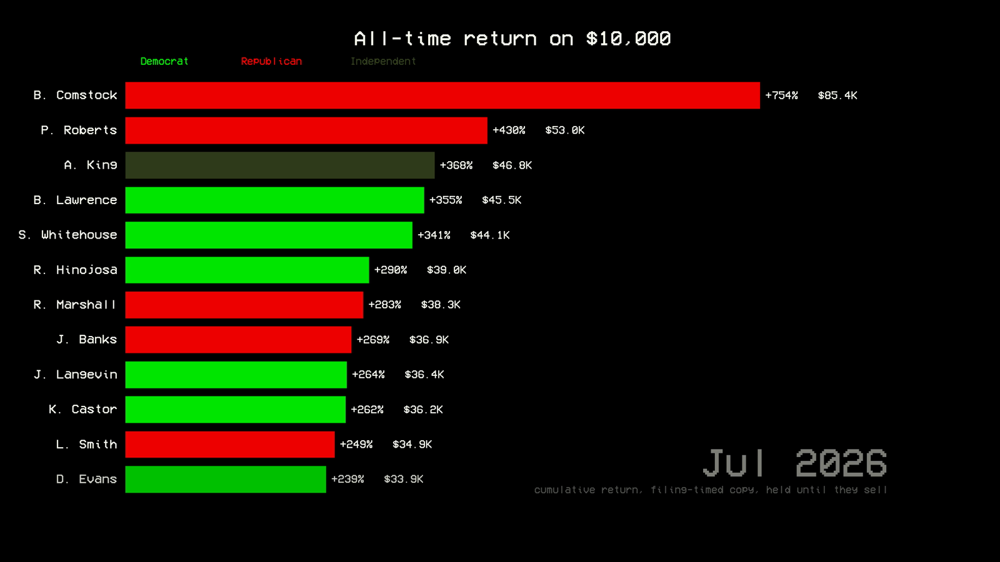

### Step 4: Where the datasets line up

`source_code/4-cross-dataset-investigation.ipynb`

Instead of copying *what* Congress buys, what if the signal is everything *around* the trade: the lobbying, the contracts, and the congressional attention, all combined? This step joins three datasets on a single ticker to see where they overlap. Lockheed Martin is the clearest example.

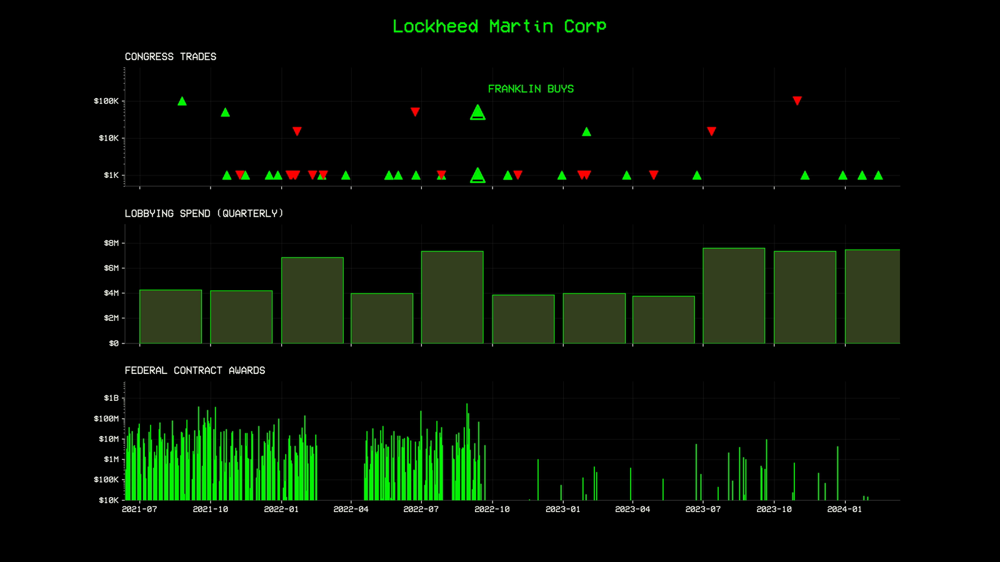

The top row is congressional trades (arrow direction is buy or sell, height is trade size). The middle row is quarterly lobbying spend. The bottom row is federal contract awards, of which Lockheed wins a great many. When a committee member buys a company that is also a top lobbyist and a top contractor, it starts to feel like a signal. This step builds a ranked research shortlist of those cases, each verified against the primary public record.

### Step 5: Turn the overlap into a strategy

`source_code/5_cross_dataset_signal.py`

Every month, score 32 federally wired companies on three things: lobbying spend over the past year, federal contracts won, and how many different members of Congress bought the stock. Normalize the three onto one scale, add them into a single composite score, buy the top 8 equal weight, then re-score and rebalance every month.

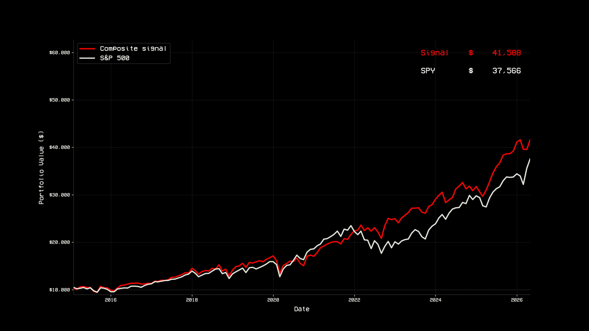

At first it looks like it works: $10,000 becomes about $42,000, and the S&P did about $38,000. But then the controls fall apart. Ignore the signal entirely and just hold all 32 companies, and you do better:

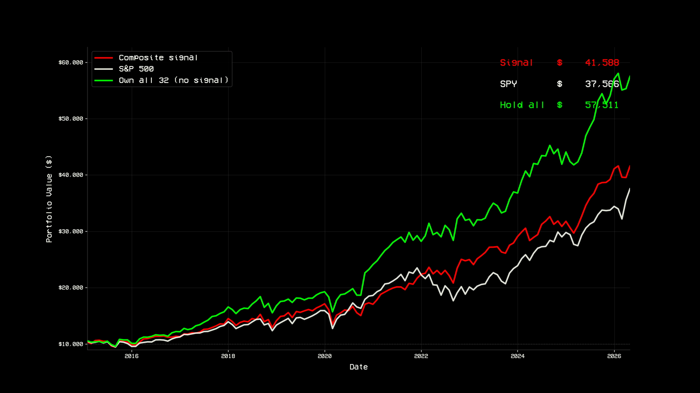

And when you line up the 8 stocks the signal ranked highest against the 8 it ranked lowest, the result is backwards:

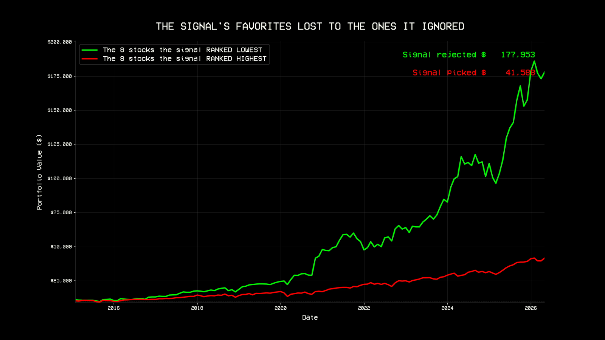

The 8 companies the signal loved made about $42,000. The 8 it told me to avoid made about **$178,000.** Following the money gave *lower* returns.

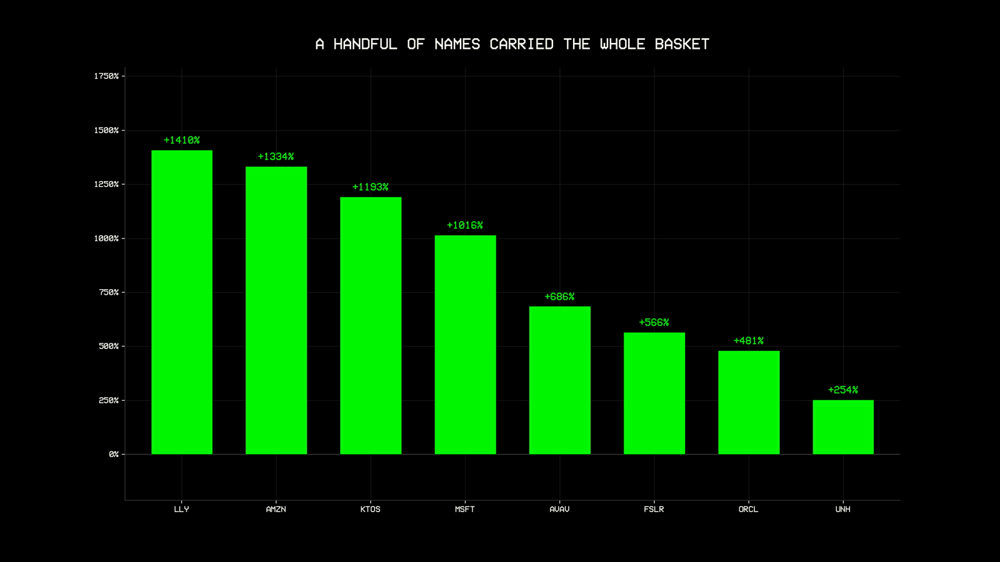

The honest reason is not that lobbying makes a stock bad. Microsoft lobbies harder than almost anyone and was one of the biggest winners. It is that the companies most dependent on Washington, the defense giants, big oil, and big pharma, are slow, mature businesses. The market's real growth has come from companies that got rich building products, not buying influence.

---

## Repository layout

```
source_code/
  lib/
    brand.py          brand theme and matplotlib styling
    animation.py      animated-chart helpers (2K 60fps H.264, audio muxed)
    backtest.py       equal-weight portfolio and per-trade backtest engines
    data_quiver.py    Quiver API client: trades, lobbying, contracts, Trump
    data_massive.py   Massive (Polygon) price client and local price cache
  1-buy-the-day-they-bought.ipynb     step 1: transaction-date entry (perfect info)
  2-disclosure-delay.ipynb            step 2: filing-date entry
  3-hold-until-congress-sells.ipynb   step 3: hold until the disclosed sale
  3-trump-moment.ipynb                the President's trades and the Apr 9 2025 case study
  4-cross-dataset-investigation.ipynb trades joined with lobbying and contracts
  5_cross_dataset_signal.py           step 5: the composite cross-dataset signal
  prefetch_data.py                    warm the price cache before a full run
  render_5.py, render_5b.py           render the step 5 animations
  show_trades.py                      quick CLI to inspect a member's trades
  requirements.txt
audio_engine/                         standalone deterministic procedural sound effects
images/                               static PNG stills used in this README
output/                               per-step CSVs and summary_stats.json
```

Rendered videos are produced locally and are not committed to the repo. The static stills in `images/` are frames from those animations.

---

## Reproducing the results

1. **Python 3.12 or newer** and **[FFmpeg](https://ffmpeg.org)** on your PATH (`winget install ffmpeg` on Windows).
2. `pip install -r source_code/requirements.txt`
3. Copy `.env.example` to `.env` and add **your own** API keys:
   ```
   QUIVER_API_KEY=...     from api.quiverquant.com  (code LOONIES for 50% off)
   MASSIVE_API_KEY=...    from massive.com
   ```
   `.env` is gitignored. Never commit your keys.
4. Run the notebooks top to bottom, in order (1 through 5). Notebook 1 does the slow initial price fetch; later steps reuse a shared local cache, so they run fast. `source_code/prefetch_data.py` can warm the cache first if you prefer.

Each step pulls its data live from the APIs, so exact figures move slightly as new disclosures and price history land.

---

## Method notes

* **Step 1 (v1)** enters every disclosed purchase on its transaction date, equal weight, 60 day hold. This is deliberately impossible, since you cannot act on a trade before it is filed. It is the "false peak."
* **Step 2 (v2)** enters on the filing date plus one trading day, the first day a retail follower could actually act.
* **Step 3** holds each position until the member discloses the matching sale, instead of an arbitrary timer, and uses only public filing dates a follower could act on at both ends.
* Equity curves use an equal weight, daily rebalanced portfolio across all open positions. Bar charts labeled "average trade return" are per trade means, a deliberately different lens from the dollar equity curves.
* Trades are only priced when the ticker has a mark within 7 days of the entry date. Reused ticker symbols whose vendor history starts years after the trade would otherwise post fake near-zero returns against a real S&P window; a curated exclusion list handles known symbol reuse cases on top of that.
* Members are identified by **BioGuideID**, not by name string, because the feed spells the same person several ways ("Scott Franklin" and "C. Scott Franklin"), which would otherwise split one member across the rankings.
* **Step 4** scores each buy of a scoped ticker universe on time alignment (buy to the largest contract award in the next 180 days), dollar size (contracts, lobbying, trade), and committee relevance via BioGuideID. Award timing keys on USASpending's `action_date`, when the contract action actually happened, not the feed's publish date, which lags by years for backfilled rows. The output is a ranked research shortlist. Every case is legal, public activity, verified against the primary record.
* **Step 5** normalizes lobbying, contracts, and Congress buy counts onto one scale, sums them into a composite score, buys the top 8 of 32 each month, and rebalances monthly. Control arms (hold all 32, bottom 8, single factor) isolate whether the signal adds anything. It does not.

---

## Data attribution

| Data | Source | Terms |
|---|---|---|
| Congress trades, lobbying, federal contracts, Trump trades | [Quiver Quantitative API](https://api.quiverquant.com) | Commercial API, bring your own key |
| Stock prices and benchmarks (daily and intraday, adjusted) | [Massive](https://massive.com/?utm_campaign=losing-loonies) (formerly Polygon.io, affiliate link) | Commercial API, bring your own key |
| Committee membership | [unitedstates/congress-legislators](https://github.com/unitedstates/congress-legislators) | Public domain |

All underlying facts (trades, filings, contract awards) are public record. Quiver's value is aggregating and normalizing them into one API instead of dozens of government websites.

---

## Disclaimer

Educational and informational content only. Not investment, financial, legal, or tax advice, and not a recommendation regarding any security. Backtested and hypothetical results have inherent limitations and do not reflect actual trading or predict future performance. All trades, filings, and contract awards referenced are matters of public record and describe legal, disclosed activity; no wrongdoing by any individual is alleged. Do your own research.

## License

Released under the [MIT License](LICENSE). Copyright (c) 2026 LosingLoonies Media Inc.
